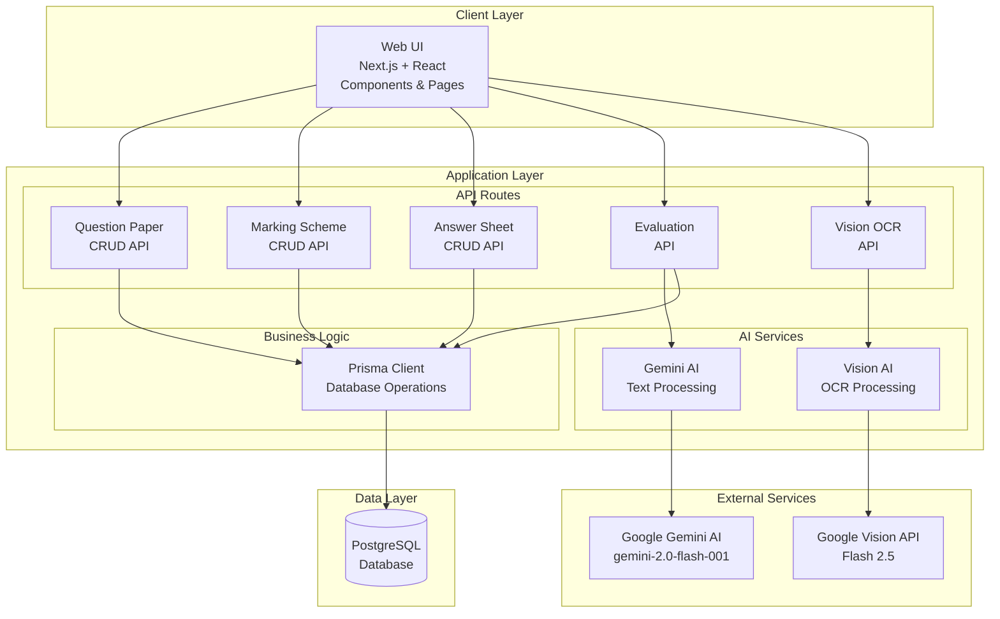

# System Architecture

## Overview

This is an AI-powered exam evaluation system designed to streamline the process of grading student answer sheets. The system allows teachers to create question papers, define marking schemes, upload student answers, and use AI to automatically evaluate responses based on predefined criteria.

The application is built as a full-stack web application using modern web technologies, with AI integration for document processing and automated grading.

## Technology Stack

### Frontend
- **Framework**: Next.js 15 (React 19)
- **Language**: TypeScript
- **Styling**: Tailwind CSS
- **UI Components**: Radix UI, Lucide Icons
- **State Management**: React Hooks
- **Theme**: next-themes (dark/light mode)

### Backend
- **Runtime**: Next.js API Routes (Node.js)
- **Database**: PostgreSQL
- **ORM**: Prisma
- **AI Services**: Google Gemini AI (Gemini 2.0 Flash), Google Vision API (Flash 2.5)

### Development & Testing
- **Testing**: Jest, React Testing Library, Playwright (E2E)
- **Linting**: TypeScript strict mode
- **Build**: Next.js with SWC
- **Package Manager**: npm

### Infrastructure
- **Deployment**: Vercel
- **Analytics**: Vercel Analytics
- **Database Hosting**: External PostgreSQL instance

## System Architecture Diagram



## Core Components

### Frontend Components

#### Main Dashboard (`src/app/page.tsx`)
- Central hub displaying all major components
- Grid layout with question paper, marking scheme, answer sheets, evaluator, and results tables

#### Question Paper Management (`src/components/QuestionPaper.tsx`)
- Create/edit question papers manually or via AI parsing
- Support for different exam types (CAT, FAT, ASSESSMENT)
- Up to 10 questions per paper with individual marks

#### Marking Scheme Management (`src/components/MarkingScheme.tsx`)
- Define evaluation criteria and marks for each question
- Manual creation or AI-assisted parsing from documents
- Flexible criteria for different question types

#### Answer Sheet Management (`src/components/AnswerSheetTable.tsx`)
- Upload and manage student answer sheets
- Support for bulk operations and data validation
- Roll number and name tracking

#### AI-Powered Evaluator (`src/components/Evaluator.tsx`)
- Select question paper, answer sheets, and marking scheme
- Batch evaluation using AI
- Real-time progress tracking and results preview

#### Results Display (`src/components/MarkSheetTable.tsx`)
- View evaluated results with individual question marks
- Export capabilities (Excel integration)
- Filtering and sorting options

### Backend API Routes

#### AI Processing Routes
- `POST /ai` - General AI text processing for parsing documents
- `POST /ai/evaluate` - Automated answer evaluation using Gemini AI
- `POST /ai/run-prisma` - Execute Prisma operations generated by AI

#### Data Management Routes
- `GET|POST /question-paper` - CRUD operations for question papers
- `GET|POST|PUT|DELETE /marking-scheme` - CRUD operations for marking schemes
- `GET|POST /answers` - CRUD operations for answer sheets
- `GET /marking-sheets` - Retrieve evaluation results

#### Utility Routes
- `POST /api/vision-ocr` - OCR processing for image-based documents using Google Vision API

## Database Schema

The system uses PostgreSQL with the following core models:

### QuestionPaper
```prisma
model QuestionPaper {
  id         String   @id @default(cuid())
  subject    String
  slot       String   // Exam slot (A1, A2, etc.)
  courseCode String
  examType   ExamType // CAT | FAT | ASSESSMENT
  totalMarks Int      @default(0)

  // Up to 10 questions with marks
  question1  String?
  mark1      Int?
  // ... question10, mark10

  @@unique([courseCode, slot, examType])
}
```

### MarkingScheme
```prisma
model MarkingScheme {
  id         String   @id @default(cuid())
  courseCode String
  slot       String
  examType   ExamType

  // Criteria and marks for each question
  mark1      Int?
  criteria1  String?
  // ... mark10, criteria10

  @@unique([courseCode, slot, examType])
}
```

### AnswerSheet
```prisma
model AnswerSheet {
  rollNo   String   @id
  name     String
  slot     String
  examType ExamType

  // Student answers (text)
  answer1  String?
  // ... answer10
}
```

### MarkingSheet
```prisma
model MarkingSheet {
  rollNo     String   @id
  name       String
  slot       String
  examType   ExamType
  totalMarks Int

  // Evaluated marks (numbers)
  answer1  Int?
  // ... answer10
}
```

## Data Flow

### Question Paper Creation Flow
1. Teacher inputs question paper details (manual) or uploads document
2. AI parses document to extract questions and marks
3. Data validated and stored in QuestionPaper table
4. UI updates to reflect new question paper

### Answer Sheet Processing Flow
1. Teacher uploads answer sheets (text or document)
2. AI extracts student answers using specialized prompts
3. Roll numbers validated and corrected automatically
4. Answers stored in AnswerSheet table

### Evaluation Flow
1. Teacher selects question paper, answer sheets, and marking scheme
2. System constructs evaluation prompt with questions, answers, and criteria
3. AI evaluates each answer and assigns marks
4. Results stored in MarkingSheet table
5. UI displays evaluation summary and progress

## AI Integration

### Document Parsing
The system uses multiple AI services for document processing:

**Google Gemini AI (Text Processing):**
- Question papers (extract questions and marks)
- Marking schemes (extract criteria and marks)
- Answer sheets (extract student responses)

**Google Vision API (OCR Processing):**
- Image-based documents and scanned papers
- Handwritten text recognition
- Document structure analysis

### Automated Evaluation
- Constructs detailed prompts with question text, student answers, and marking criteria
- Uses AI to assign numerical marks based on predefined rubrics
- Ensures marks stay within valid ranges (0 to maximum marks)

### Prompt Engineering
- Specialized system instructions for different document types
- Context-aware parsing with exam type detection
- Roll number correction and validation logic

## Security Considerations

### API Security
- Environment variables for sensitive keys (GEMINI_API_KEY, DATABASE_URL)
- Input validation on all API endpoints
- CORS configuration for web access

### Data Privacy
- Student data handled according to privacy requirements
- No external data sharing beyond AI processing
- Secure database connections

## Performance Optimization

### Frontend
- Client-side caching for API responses
- Lazy loading of components
- Optimized re-renders with React hooks

### Backend
- Database connection pooling via Prisma
- Efficient queries with proper indexing
- Streaming responses for large datasets

### AI Processing
- Batch processing for multiple evaluations
- Rate limiting considerations for AI API calls
- Error handling and retry logic

## Deployment & DevOps

### Development
- Local development with `npm run dev`
- Database management with Prisma CLI
- Testing with Jest and Playwright

### Production
- Deployed on Vercel with automatic scaling
- PostgreSQL database (managed service)
- Environment-specific configuration

### Monitoring
- Vercel Analytics for usage tracking
- Error logging and monitoring
- Performance metrics collection

## Future Enhancements

### Potential Features
- Advanced analytics and reporting
- Integration with learning management systems
- Mobile application support
- Multi-language support for international exams
- Advanced AI features (plagiarism detection, feedback generation)

### Technical Improvements
- GraphQL API for more flexible data fetching
- Real-time collaboration features
- Advanced caching strategies
- Microservices architecture for scalability