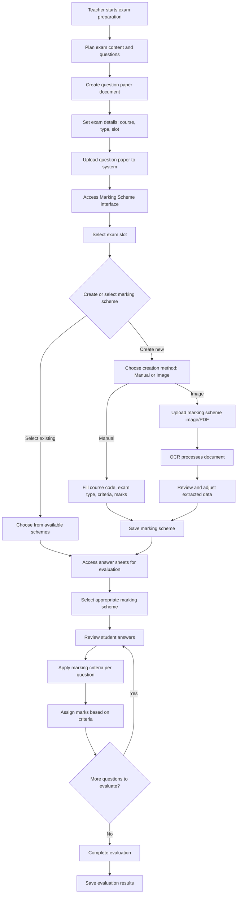

# Teacher Flowchart: From Question Paper to Answer Sheet Evaluation

```mermaid
flowchart TD
    A[Teacher starts exam preparation] --> B[Plan exam content and questions]
    B --> C[Create question paper document]
    C --> D[Set exam details: course, type, slot]
    D --> E[Upload question paper to system]
    E --> F[Access Marking Scheme interface]
    F --> G[Select exam slot]
    G --> H{Create or select marking scheme}
    H -->|Create new| I[Choose creation method: Manual or Image]
    I -->|Manual| J[Fill course code, exam type, criteria, marks]
    I -->|Image| K[Upload marking scheme image/PDF]
    K --> L[OCR processes document]
    L --> M[Review and adjust extracted data]
    J --> N[Save marking scheme]
    M --> N
    H -->|Select existing| O[Choose from available schemes]
    O --> P[Access answer sheets for evaluation]
    N --> P
    P --> Q[Select appropriate marking scheme]
    Q --> R[Review student answers]
    R --> S[Apply marking criteria per question]
    S --> T[Assign marks based on criteria]
    T --> U{More questions to evaluate?}
    U -->|Yes| R
    U -->|No| V[Complete evaluation]
    V --> W[Save evaluation results]
```